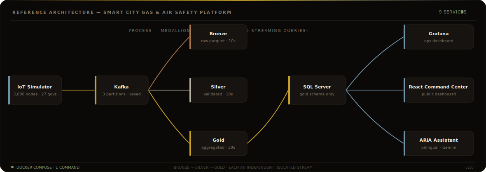

<!-- ══════════════════════════════════════════════════════════════
     ISMAEL KHALIFA — Data Engineer · GitHub README
     ══════════════════════════════════════════════════════════════ -->

<div align="center">


<br/>

[](https://git.io/typing-svg)

<br/>


</div>

<br/>

---

## ⚡ About Me

```python
class DataEngineer:
    name       = "Ismael Khalifa"
    location   = "Egypt"
    focus      = ["Real-Time Pipelines", "Big Data Architecture", "Data Lakehouses"]
    languages  = ["Python", "SQL", "C++", "Bash"]
    currently  = "Building a Smart City IoT Safety Monitoring Platform — DEPI"
    open_to    = "Data Engineering  ·  Analytics Engineering  ·  Platform Engineering"
```

> I design and build **end-to-end data infrastructure** — from raw ingestion through distributed
> processing to analytics-ready storage. My projects prioritise fault tolerance, real-time
> responsiveness, and production readiness, with a growing focus on AI-augmented data products.

<br/>

---

## 🎯 Core Expertise

<table>
<tr>
<td width="50%">

**⚙️ ETL / ELT Architecture**
Fault-tolerant batch & streaming pipelines, schema evolution, data quality gates at scale.

</td>
<td width="50%">

**⚡ Real-Time Streaming**
Kafka + Spark Structured Streaming, stateful aggregations, exactly-once semantics.

</td>
</tr>
<tr>
<td width="50%">

**🏗️ Data Lakehouse Design**
Delta Lake, medallion architecture (Bronze→Silver→Gold), dimensional modelling, ACID transactions.

</td>
<td width="50%">

**🤖 AI-Augmented Pipelines**
LangChain + OpenAI integration for intelligent alerting and natural-language data querying.

</td>
</tr>
</table>

<br/>

---

## 🛠️ Tech Stack

<div align="center">

**— Languages —**

[](https://skillicons.dev)

**— Big Data & Streaming —**


**— Databases & Storage —**


**— Integration · BI · AI —**


**— DevOps & Infrastructure —**

[](https://skillicons.dev)

</div>

<br/>

---

## 🔄 Reference Architecture



<br/>

---

## 📂 Featured Projects

<table>
<tr>
<td>

### 🏙️ Smart City Gas & Air Safety Monitoring Platform


A fully containerised, end-to-end **real-time IoT safety platform** monitoring gas leakage,
air pollution, temperature, and smoke across all **27 Egyptian governorates** using authentic
place names. Includes an embedded **LangChain / OpenAI chatbot** for natural-language querying
of live sensor data and alert history.

**Key Highlights**
- ⚡ Sub-second latency streaming via Kafka + Spark Structured Streaming
- 🗺️ Nationwide simulation engine — 27 governorates · 100+ sensor nodes
- 🤖 AI chatbot layer for intelligent, context-aware alert querying
- 📦 Single `docker-compose up` — fully reproducible deployment
- 📊 Power BI dashboards with live KPIs, geo-maps, and trend analytics


</td>
</tr>
</table>

<table>
<tr>
<td width="50%">

### 🔁 Scalable Batch Data Pipeline


Production-grade pipeline with schema validation, data quality
enforcement, and orchestrated multi-stage transformations.
Built for fault tolerance and horizontal scale-out.


</td>
<td width="50%">

### 🏛️ Enterprise Data Warehouse & BI


Star-schema warehouse integrating heterogeneous source systems
via SSIS workflows, surfaced through executive-level Power BI
dashboards with KPI tracking and trend analysis.


</td>
</tr>
</table>

<br/>

---

## 📈 GitHub Activity

<div align="center">


&nbsp;


<br/><br/>


<br/><br/>


</div>

<br/>

---

## 📫 Let's Connect

<div align="center">

[](https://www.linkedin.com/in/ismael-khalifa/)
&nbsp;
[](https://github.com/som3a0)
[](https://ismaelkhalifa.netlify.app/)
<br/>


*⭐ If my work helped you — a star on the repo means a lot.*

</div>
